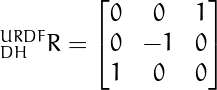
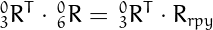

## Project: Kinematics Pick & Place

---


**Steps to complete the project:**  


1. Set up your ROS Workspace.
2. Download or clone the [project repository](https://github.com/udacity/RoboND-Kinematics-Project) into the ***src*** directory of your ROS Workspace.  
3. Experiment with the forward_kinematics environment and get familiar with the robot.
4. Launch in [demo mode](https://classroom.udacity.com/nanodegrees/nd209/parts/c199593e-1e9a-4830-8e29-2c86f70f489e/modules/8855de3f-2897-46c3-a805-628b5ecf045b/lessons/91d017b1-4493-4522-ad52-04a74a01094c/concepts/ae64bb91-e8c4-44c9-adbe-798e8f688193).
5. Perform Kinematic Analysis for the robot following the [project rubric](https://review.udacity.com/#!/rubrics/972/view).
6. Fill in the `IK_server.py` with your Inverse Kinematics code. 

## [Rubric](https://review.udacity.com/#!/rubrics/972/view) Points
### Here I will consider the rubric points individually and describe how I addressed each point in my implementation.  

---
### Writeup / README

#### 1. Provide a Writeup / README that includes all the rubric points and how you addressed each one.  You can submit your writeup as markdown or pdf.  

You're reading it!

### Kinematic Analysis
#### 1. Run the forward_kinematics demo and evaluate the kr210.urdf.xacro file to perform kinematic analysis of Kuka KR210 robot and derive its DH parameters.

With the demo flag set to `true` in `kuka_arm/launch/inverse_kinematics.launch`, the forward_kinematics demo can be launched by executing the following commands in a terminal:
```
cd /kuka_arm/scripts
./safe_spawner.sh
```
RViz and Gazebo (**Figure 1**) windows are launched, which allow the user to see the full process of the robot arm picking up the target object on the shelf and dropping it in the bin.  Each step of the process is initiated by selecting "Next" in the RViz window.  This project concerns deriving and implementing an inverse kinematics solution for the joint angles necessary to move the robot arm end-effector along planned paths.

|                                                        |
|----------------------------------------------------------------------------------------|
| **Figure 1.  Gazebo window showing the Kuka KR210 robotic arm and simulation environment.** |

Running the `roslaunch kuka_arm forward_kinematics.launch` command will launch a RViz session that allows the user to interact with the robot arm by changing the angles of each joint and observing the motion of the arm and the pose of each joint.  **Figure 2** shows a transparent image of the arm from RViz in its "zero configuration" (all joint angles equal to zero ) for assigning parameters in the modified Denavit-Hartenberg (DH) parameter convention.  All of the significant axes, parameters, and labels have been sketched onto the image, including the joint, J{i}, and link, L{i}, labels.  The rotation axis and positive rotation direction is also shown for each joint angle theta.

|                                  |
|---------------------------------------------------------------------|
| **Figure 2.  DH parameters sketch for the Kuka KR210 robotic arm.** |

Given the sketch in **Figure 2**, the `kr210.urdf.xacro` file located in the `kuka_arm/urdf/` directory can be used to fill in the DH parameters table.  The twist angles, alpha{i-1}, from Z{i-1} to Z{i} about X{i-1} are not shown in the sketch, but can be easily observed, and are either zero or a rotation of 90 degrees.  The link lengths, a{i-1}, from Z{i-1} to Z{i} along X{i-1}, as well as the link offsets, d{i}, from X{i-1} to X{i} along Z{i}, can be gathered from the `<!-- joints -->` section of `kr210.urdf.xacro`.  The xyz-coordinates given are from the previous joint to the current joint based on the URDF axes shown in the sketch, and either directly give the parameters or can be summed to give the parameters.  For example, the gripper link offset, d{7}, can be found by adding the x-coordinate of `joint_6` and the x-coordinate of `gripper_joint`: d{7} = 0.193 + 0.11 = 0.303.  For the joint angles, theta{i}, from X{i-1} to X{i} about Z{i}, only theta{2} needs a constant offset correction of -90 degrees, as shown in the sketch.  Since the added gripper frame does not have a joint, theta{7} can be set to 0.  **Table 1** shows all of the DH parameters, with each row in the table corresponding to the transform from frame {i-1} to frame {i}.

| **Table 1.  DH parameters table for the Kuka KR210 robotic arm.** |
|-------------------------------------------------------------------|
|                                  |

#### 2. Using the DH parameter table you derived earlier, create individual transformation matrices about each joint. In addition, also generate a generalized homogeneous transform between base_link and gripper_link using only end-effector(gripper) pose.

[Tgen]: images/matrices/Tgen.png
[T0_1]: images/matrices/T0_1.png
[T1_2]: images/matrices/T1_2.png
[T2_3]: images/matrices/T2_3.png
[T3_4]: images/matrices/T3_4.png
[T4_5]: images/matrices/T4_5.png
[T5_6]: images/matrices/T5_6.png
[TB_G]: images/matrices/TB_G.png

The general transformation between adjacent links in the DH convention is:

![][Tgen]

Combining the general transformation with **Table 1** yields the following individual transformation matrices about each joint:

|           |           |
|-----------|-----------|
| ![][T0_1] | ![][T3_4] |
| ![][T1_2] | ![][T4_5] |
| ![][T2_3] | ![][T5_6] |

As seen in **Figure 2**, the URDF axes do not align with the axes in the DH convention for the gripper_link (end-effector).  The following correction is required to go from the gripper_link orientation on the URDF axes to the orientation on the DH axes:


which yields the following rotation matrix:



Given the yaw (y), pitch (p), and roll (r) of the gripper_link, the following x-y-z extrinsic rotations and correction above can be applied to give the rotation part of the generalized homogeneous transformation between the base_link and gripper_link, as shown in the following equation:


Combining the rotational part from the equation above and the translation part from the gripper position (px, py, pz) yields the following generalized homogeneous transformation between the base_link (B) and gripper_link (G):


The matrices included in this write-up are generated directly from the implemented project solution module `kinematics.py` located in `kuka_arm/scripts`.  The `kinematics.py` module is imported by the `matrices2png.py` script located in `images/matrices`, which uses `sympy.preview()` to directly output images of SymPy matrices using LaTeX in the background (LaTeX must be installed for the script to work).

#### 3. Decouple Inverse Kinematics problem into Inverse Position Kinematics and Inverse Orientation Kinematics; doing so derive the equations to calculate all individual joint angles.

##### Inverse Position Kinematics

Given an end-effector pose, the wrist center vector (wc) can be calculated from the following:


where vector p is the end-effector position, and vector n is the last column of matrix Rrpy (representing the end-effector orientation along the Z-axis of the local coordinate frame).

Once the coordinates of the wrist position are obtained, the first three joint angles can be calculated as derived in **Figure 3** and **Figure 4**.  First, theta{1} is found by a top-down view of the arm.  Second, theta{2} and theta{3} are found by using the law of cosines in the 2D plane defined by joint centers 2, 3, and 5.

|    |
|-------------------------------------------------------------|
| **Figure 3.  Theta 1 in the X-Y Plane.**                    |

|   |
|-------------------------------------------------------------|
| **Figure 4.  Theta 2 and 3 in the Z-r Plane.**              |

The theta equations given above are only valid for the arm configuration shown.  The same wrist center position can be reached by reflecting triangle ABC about side B; however, the theta equations would have to be altered.  For example, -a would need to be replaced with +a in the equation for theta{2}.  This alternate configuration was not chosen because it is susceptible to joint limitations and interference with the ground for the given workspace and task.

##### Inverse Orientation Kinematics

Using the rotation parts of the individual transformation matrices about each joint, the rotation matrix between the base_link and link_3 can be calculated as follows: 


The rotation matrix between the base_link and link_6 can be similarly calculated:


Since the rotation matrix between the base_link and link_6 is equal to Rrpy, the following equation:



yields two matrices that are equal to the rotation matrix between link_3 and link_6:


Note that for a rotation matrix the inverse is equal to the transpose, so the transpose of R0_3 is interchangeable with the inverse of R0_3 in the previous equations.  The rotation matrix on the right hand side (rhs) is a function of the roll, pitch, and yaw of the end-effector as well as the three theta angles computed in [Inverse Position Kinematics](#inverse-position-kinematics), so the only unknown variables are theta 4, 5, and 6 found on the left hand side (lhs).  Using the following trigonometric identity for the tangent of theta:


equations for the remaining theta angles can be derived from the left hand side matrix:


Long elements have been replaced with `...`, and are not needed in the derivation.  A possible set of equations for theta 4, 5, and 6 are: 


where rhs{i,j} represents a corresponding element from the known right-hand-side matrix.

### Project Implementation

#### 1. Fill in the `IK_server.py` file with properly commented python code for calculating Inverse Kinematics based on previously performed Kinematic Analysis. Your code must guide the robot to successfully complete 8/10 pick and place cycles. Briefly discuss the code you implemented and your results. 


[//]: # (Here I'll talk about the code, what techniques I used, what worked and why, where the implementation might fail and how I might improve it if I were going to pursue this project further.)

In order to easily use the same code in the `kuka_arm/scripts/IK_server.py` and `IK_debug.py` scripts, the kinematics implementation is separated into the `kinematics.py` module in the `kuka_arm/scripts` directory.  The `kinematics` module develops both the forward and inverse kinematics equations symbolically within the `kinematics()` function.  Then lambda functions are generated in `getLambdas()` for evaluating the end effector position (`eval_ee`) given six joint angles, the wrist center position (`eval_w`) given an end effector pose, and the six joint angles (`eval_theta`) given an end effector pose.  The lambda functions are built with the `numpy` numeric system, and evaluate on the order of 100 times faster than `evalf` from `sympy`.

Using `symplify` on the final equations reduces the amount of calculations the lambda functions perform, but adds approximately 1 minute to the module import time. However, the symbolic equations from the `kinematics()` function are saved to the `kinematics.pickle` file after the first module import, so subsequent imports can load the symbolic equations in seconds instead of re-generating and simplifying them over minutes.  The ability to force the calculation of the symbolic equations, or turn simplification on and off, is enabled by the following control flags (shown in there default configuration) at the head of `kinematics.py`:
```python
# Control Flags
#-----------------------------------------------------------------------------------------
FORCE    = False # True: force calculation of kinematics rather than read from pickle.
SIMPLIFY = False # True: simplify the final symbolic equations (adds ~1 min to wall-time).
DEBUG    = False # True: print final symbolic equations.
```

Lambda functions `eval_ee`, `eval_w`, and `eval_theta` are imported into the `IK_debug.py` script and give the following timing performance:
```
Total run time to calculate joint angles from pose is 0.0003 seconds
```

In the `kinematics()` function of `kinematics.py` a -0.03598446 radian adjustment is applied to theta{3} to correct for the sag in link{4}.  Calculating the inverse kinematics with `eval_theta`, given an end-effector pose, and supplying the resulting joint angles to the forward kinematics equation `eval_ee`, gives the following end-effector error:
```
End effector error for x position is: 0.00000000
End effector error for y position is: 0.00000000
End effector error for z position is: 0.00000000
Overall end effector offset is: 0.00000000 units
```
The theta{3} adjustment was converged upon through the bisection method until the overall end-effector offset was zero with a precision of nine (0.000000000).

Similarly, `eval_ee` and `eval_theta` are imported into `IK_server.py`, and `eval_ee` is used to calculate the overall end-effector error from the angles returned by `eval_theta`.  As an additional exercise in ROS, `IK_server.py` is setup to publish the end-effector error to the `ee_error` topic using the custom `Float64List` message type, and the `plot_error` node (`kuka_arm/scripts/plot_error.py`) is written to subscribe to the topic.  Upon receipt of a message, `plot_error` plots the overall end-effector error versus the end-effector pose index as shown in **Figure 5**.

|                                                  |
|----------------------------------------------------------------------------------|
| **Figure 5. Sample overall end-effector error plot from the `plot_error` node.** |

These end-effector error plots are mostly boring because the error is always 0.123E-09 so far (differences shown in the plot occur beyond the axis precision).  The error can be minimized even further by continuing the bisection convergence of the theta{3} correction.

With the demo flag set to `false` in `kuka_arm/launch/inverse_kinematics.launch`, the following three steps can be executed in three separate terminals to run the final project:
1.  Launch the simulator framework including Gazebo and RViz:
```
cd kuka_arm/scripts
./safe_spawner.sh
```
2.  Run the `IK_server` node:
```
rosrun kuka_arm IK_server.py
```
3.  Run the `plot_error` node:
```
rosrun kuka_arm plot_error.py
```
From here the simulation can be advanced through each step of the process by selecting "Next" in the RViz window.  Each time a path is planned as displayed in **Figure 6**, the `IK_server` node provides necessary joint angles to follow the path, and the `plot_error` node plots the error between the forward kinematics solution and the requested end-effector positions.

|                                                         |
|----------------------------------------------------------------------------------------|
| **Figure 6. RViz sample end-effector path for which `IK_server` supplies corresponding joint angles.** |

Failure to pickup the item from the random shelf position and place it in the bin has not been observed with the current project implementation.  However, the wrist does occasionally rotate through a larger angle when a shorter angle that yields an equivalent pose is possible, leaving room for improvement.
